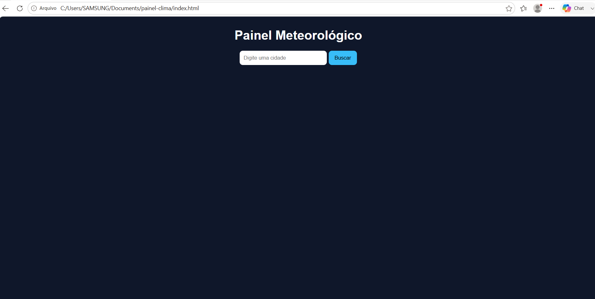

# 🌤️ Painel de Clima

Projeto simples que mostra a temperatura de qualquer cidade em tempo real usando uma API.

## 🔗 Acesse o projeto online
https://gentle-horse-248ea7.netlify.app/

Obs: Caso o link não abra em uma rede wifi corporativa/escolar ou provedor local ,sugiro abrir em uma rede 4G/5G ou outras redes wifi que não bloqueia o domínio usado.
## 🖼️ Preview do projeto

## 🚀 Tecnologias usadas
- HTML
- CSS
- JavaScript

## 📌 Funcionalidades
- Buscar cidade
- Mostrar temperatura
- Interface simples e rápida

## 🧠 Autor
Antero Vieira
